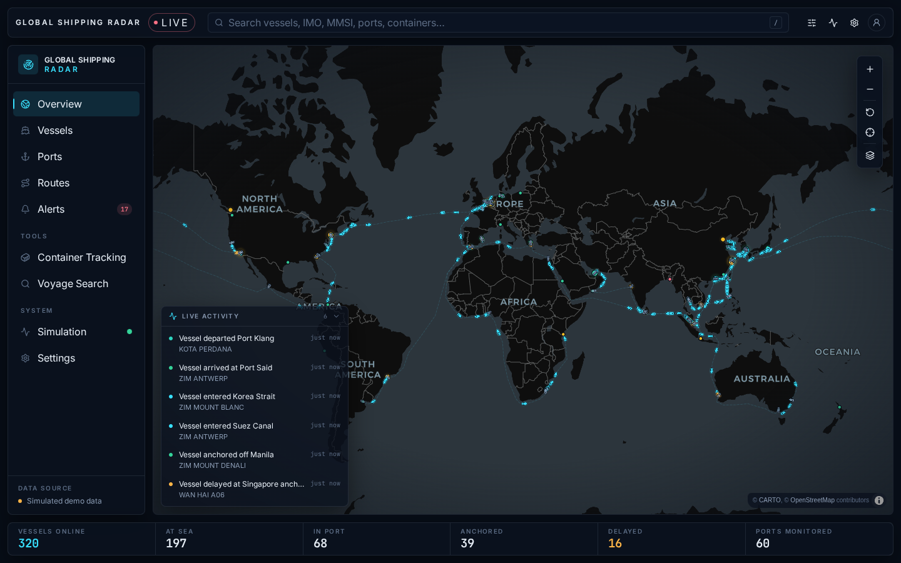

# Global Shipping Radar

A live, interactive global maritime logistics dashboard: a cinematic world map of container vessels moving along the world's major shipping lanes, with vessel search, filters, vessel and port details, routes, statistics, alerts, a live activity feed and container tracking.

> **Two data modes.** By default the dashboard runs on a built-in simulation: vessel names and operators are realistic, but every position, voyage, ETA, port statistic, event and container record is generated locally for demonstration. Switch **Vessel data source** to **Live AIS · Baltic** (Simulation or Settings panel) and vessel positions come from a real AIS feed (Fintraffic / Digitraffic, Finnish AIS network, CC BY 4.0). Port statistics and container records stay simulated in both modes and the UI labels every record with its provenance.



## Contents

1. [Project overview](#1-project-overview)
2. [Tech stack](#2-tech-stack)
3. [Installation](#3-installation)
4. [Running the app](#4-running-the-app)
5. [How the simulation works](#5-how-the-simulation-works)
6. [Data architecture](#6-data-architecture)
7. [Map configuration](#7-map-configuration)
8. [Environment variables](#8-environment-variables)
9. [Replacing `MockVesselProvider` with a real API](#9-replacing-mockvesselprovider-with-a-real-api)
10. [Adding a container tracking provider](#10-adding-a-container-tracking-provider)
11. [Production deployment](#11-production-deployment)
12. [Keyboard shortcuts](#12-keyboard-shortcuts)
13. [Quality checks](#13-quality-checks)

---

## 1. Project overview

The application is a single-page maritime operations console built around a MapLibre world map.

| Area | What it does |
| --- | --- |
| **Overview (map)** | 320 simulated container vessels rendered as heading-oriented ship markers on 9 major shipping lanes, 60 ports coloured by congestion, subtle lane lines, a traffic heatmap layer, hover tooltips, click-to-open detail panels, route drawing, floating filter / layers / simulation / settings panels and a live activity feed. |
| **Search** | One search box for vessel name, IMO, MMSI, operator, destination, port, maritime location (straits, canals, regions) and container numbers, with smart classification of the query, grouped results, keyboard navigation and fly-to. |
| **Vessels** | Sortable, searchable, filterable, paginated fleet table (responsive card list on phones). Rows focus the map. |
| **Ports** | Port monitoring table with congestion indicators and region filter. Rows open the port panel and zoom the map. |
| **Routes** | Per-lane statistics computed from the live fleet (vessels, average transit, active, delayed) with "view on map" lane highlighting. |
| **Alerts** | High congestion, vessel delay and high traffic alerts derived from the simulation; clicking one moves the map to the location. |
| **Container Tracking** | Dedicated tracking page with a milestone timeline for 24 demo ISO 6346 container numbers (valid check digits). |
| **Voyage Search** | Find vessels sailing between a port pair (scheduled calls or lane transits), by operator or voyage number. |
| **Simulation & Settings** | Pause/resume/step the simulation, change update frequency and time acceleration, switch dark/light theme, map layers, speed and distance units. Preferences persist in `localStorage`. |

Desktop is the primary target; tablet and phone layouts collapse the sidebar into a bottom navigation bar, show detail panels as bottom sheets and use drawers for filters.

## 2. Tech stack

- [Astro](https://astro.build) 7 (static output) with the React integration
- [React](https://react.dev) 19 for the interactive application
- [TypeScript](https://www.typescriptlang.org) in `strictest` mode
- [Tailwind CSS](https://tailwindcss.com) 4 (Vite plugin) with a token-based dark/light theme
- [MapLibre GL JS](https://maplibre.org) 6 for the map (GeoJSON sources, symbol/circle/line/heatmap layers)
- [Lucide](https://lucide.dev) icons
- No backend, no external APIs, no API keys for the MVP

## 3. Installation

Requirements: Node.js 20 or newer (tested on Node 22) and npm.

```bash
git clone <this repository>
cd Global-Shipping-Radar
npm install
cp .env.example .env   # optional – all variables have sensible defaults
```

## 4. Running the app

```bash
npm run dev        # start the dev server on http://localhost:4321
npm run build      # type-check (astro check) and build to ./dist
npm run preview    # serve the production build locally
npm run check      # Astro + TypeScript diagnostics only
npm run test:sim   # headless soak test of the simulation engine (see §13)
npm run data:world # regenerate the offline fallback world outlines
```

## 5. How the simulation works

Everything "live" is driven by `SimulationEngine` (`src/lib/simulation/engine.ts`). It owns an external store that React components subscribe to through a small selector hook (`src/lib/store/createStore.ts`), so no component runs its own interval.

Each **tick** (default every 2 s of wall-clock time, representing 1 simulated hour):

1. **`updateVesselPositions()`** moves every `underway` vessel along its lane. Vessels sail great-circle legs between hand-placed waypoints that follow real sea corridors (Malacca and Singapore Straits, Suez, Bab-el-Mandeb, Gibraltar, the English Channel, Panama, Tokara/Korea Straits, the Cape, Lombok, Bass Strait, …). Distance per tick = speed × simulated hours; heading is the bearing to the next waypoint. Vessels never jump: the map interpolates between ticks with `requestAnimationFrame`, so movement is continuous at any update interval.
2. **Port calls.** Reaching a scheduled call switches the vessel to `moored` (or `anchored` / `delayed` when the port is congested), it dwells for a while, then departs with a fresh voyage number, route and ETA. At the end of a lane the vessel turns around, so the demo runs indefinitely.
3. **Activity events** ("Vessel entered Singapore Strait", "Vessel departed Port Klang", "Port congestion increased", "ETA revised …") are generated from real transitions in the simulation and appended to the 20-item feed.
4. **Port statistics** drift with a mean-reverting random walk every five ticks; congestion level follows average waiting time.
5. **Alerts** are re-derived every five ticks: high congestion ports, delayed vessels, and chokepoints with heavy traffic.

The fleet itself is generated deterministically from a seeded PRNG (`src/data/vessels.ts`), so the same vessels appear on every load and the documented flows (search `EVER ACE`, `MSBU5471161`, `Singapore`) behave predictably. A few "hero" vessels are pinned to well-known positions.

The **Simulation** panel (sidebar → System → Simulation, or the LIVE badge) exposes: pause/resume, single step, update frequency (1/2/5 s), simulated time per update (15 min / 1 h / 3 h), and toggles for vessel movement and activity generation.

## 6. Data architecture

```text
src/
  components/         React UI (map, panels, pages, navigation, search, ui primitives)
    map/              MapView (wires stores → MapLibre), controls, tooltip
    panels/           Vessel / Port / Container detail panels, Filters, Simulation, Settings
    dashboard/        Stats bar, activity feed, page shell
    vessels/ ports/ routes/ alerts/ tracking/ voyage/   full-page views
  data/               Simulated datasets
    ports.ts          60 ports with coordinates, UN/LOCODE and demo statistics
    lanes.ts          9 shipping lanes as waypoint polylines through real sea corridors
    vessels.ts        Deterministic fleet generator (320 vessels) + navigation state
    containers.ts     24 demo container tracking records (valid ISO 6346 check digits)
    operators.ts      Carriers, vessel naming, flags, container prefixes
    zones.ts          Named maritime areas (straits, canals, seas) for events/alerts/search
    regions.ts        Region bounds + position → region classifier
  lib/
    providers/        Data provider interfaces + Mock implementations (the API boundary)
    simulation/       SimulationEngine, boot, navigation types
    map/              MapScene (MapLibre wrapper), style resolution + offline fallback,
                      canvas-drawn vessel icons, GeoJSON builders, imperative map bus
    search/           Query classifier (container / IMO / MMSI / text) and ranked search
    store/            Minimal external store, UI store, persisted settings store
    formatting/       Number, date, speed, distance and relative-time formatting
    geo.ts            Haversine distance, bearing, destination point, great-circle interpolation
    selectors.ts      Fleet statistics, filtering, lane statistics, nearby vessels
  types/              Vessel, Port, Container, ShippingLane, events, settings
  pages/index.astro   The single Astro page mounting the React app
scripts/
  prepare-world-data.mjs   Builds public/data/world-110m.geojson (offline basemap fallback)
  soak-simulation.ts       Headless engine soak test
```

Business logic (movement, search, filtering, statistics) lives in `src/lib`; components only render state and dispatch actions. Views are switched client-side and mirrored to the URL hash (`#vessels`, `#ports`, …) so they can be linked.

## 7. Map configuration

The map uses MapLibre GL JS with free, key-less basemaps by default:

- Dark theme: CARTO **Dark Matter** (`https://basemaps.cartocdn.com/gl/dark-matter-gl-style/style.json`)
- Light theme: CARTO **Positron** (`https://basemaps.cartocdn.com/gl/positron-gl-style/style.json`)

Both can be overridden with environment variables (see below). Any MapLibre-compatible style URL works, including styles that need a token embedded in the URL (never hard-code a key in source; put the full URL in `.env`).

**Offline fallback.** If the basemap cannot be fetched (no network, blocked CDN) the app automatically switches to a bundled style rendered from Natural Earth 1:110m country outlines (`public/data/world-110m.geojson`), so development never shows a blank map. Set `PUBLIC_MAP_STYLE_URL=local` to force it.

**Maritime re-theme.** The CARTO styles ship as neutral grey cartography, so after every style load `src/lib/map/basemapTheme.ts` repaints the basemap layers by id into a nautical palette: deep-navy ocean and slate land in dark mode, soft-blue ocean and warm light land in light mode, with quiet borders and labels. The pass is best-effort and skips layers it doesn't recognise, so custom styles still work. The bundled offline fallback uses the same palette.

Radar layers are added on top of whichever basemap loads: a faint nautical graticule, lanes (dashed lines), ports (congestion-coloured circles + labels), traffic heatmap, vessel symbols (canvas-drawn ship icons rotated by heading, status-coloured), vessel labels (zoom ≥ 5.5, toggleable) and the highlighted route/lane lines. All vessel data goes through a single GeoJSON source updated with `setData`; there are no per-vessel DOM elements.

**Map controls.** Besides zoom, reset and world view, the control stack has a "person" marker (Google Maps style): drag it onto the map and release to zoom to that spot, or click it and then click the map. If a port is within 90 nm of the drop the port panel opens. The desktop sidebar collapses to an icon rail via the button at its bottom; the state is remembered.

## 8. Environment variables

Copy `.env.example` to `.env`. All variables are optional.

| Variable | Default | Purpose |
| --- | --- | --- |
| `PUBLIC_MAP_STYLE_URL` | CARTO Dark Matter | MapLibre style JSON URL for the dark theme. `local` forces the bundled offline style. |
| `PUBLIC_MAP_STYLE_URL_LIGHT` | CARTO Positron | Style URL for the light theme. |
| `PUBLIC_SIM_INTERVAL_MS` | `2000` | Default simulation update interval in milliseconds (users can change it in the UI). |
| `PUBLIC_DEFAULT_DATA_SOURCE` | `simulated` | `simulated`, `digitraffic` or `aisstream`: which vessel data source new visitors start with. |
| `AISSTREAM_API_KEY` | – | **Server-only** (no `PUBLIC_` prefix). Enables the Global AIS relay. Create a free key at aisstream.io and set it in Vercel → Project → Settings → Environment Variables. |
| `AISSTREAM_WS_URL` | AISStream's endpoint | Server-only override of the WebSocket URL, used with the mock server in tests. |
| `HLAG_CLIENT_ID` / `HLAG_CLIENT_SECRET` | unset (demo records only) | Server-only. Hapag-Lloyd API Portal application credentials (Track & Trace product). Enables live container tracking through `/api/containers/track`. |
| `HLAG_API_BASE` | `https://api.hlag.com/hlag/external/v2` | Server-only override of the Hapag-Lloyd API base URL, used with the mock server in tests. |

Reserved for future providers (not read yet): `CONTAINER_TRACKING_API_URL`, `CONTAINER_TRACKING_API_KEY`.

Example `.env`:

```dotenv
PUBLIC_MAP_STYLE_URL=https://basemaps.cartocdn.com/gl/dark-matter-gl-style/style.json
PUBLIC_MAP_STYLE_URL_LIGHT=https://basemaps.cartocdn.com/gl/positron-gl-style/style.json
PUBLIC_SIM_INTERVAL_MS=2000
```

## 8a. Live AIS mode

Live mode is built on a small pluggable layer in `src/lib/ais/` and `src/lib/live/`:

| Piece | Role |
| --- | --- |
| `LiveAISSource` (`src/lib/ais/types.ts`) | Contract for a live source: `fetchVessels()` returns a snapshot of `Vessel` records plus coverage, attribution and poll interval. |
| `DigitrafficAISSource` (`src/lib/ais/digitraffic.ts`) | The shipped source. Calls `https://meri.digitraffic.fi/api/ais/v1/locations` and `/vessels` directly from the browser (CORS-enabled, no key), joins positions with static data by MMSI, keeps cargo and tanker classes, drops positions older than 30 minutes. |
| `src/lib/ais/codes.ts` | AIS decoding: MID → flag, ship-type → class, navigational status → dashboard status, packed MMDDHHMM ETA, destination clean-up (LOCODE and "VIA" handling). |
| `LiveFeedService` (`src/lib/live/liveFeed.ts`) | Polls the source every 30 s (Digitraffic caches for 60 s), hands snapshots to the engine, exposes status/attribution to the UI. |
| `SimulationEngine.enterLiveMode()` / `setLiveVessels()` | Parks the simulated fleet, dead-reckons live vessels along course and speed between polls, turns AIS status changes between polls into arrival/departure events, and keeps real-time (not accelerated) clocks. |

What is real in live mode: positions, course, speed, heading, navigational status, name, IMO, MMSI, call sign, flag, dimensions, declared destination and ETA, the activity feed's arrivals/departures/zone entries, and the "high traffic" alerts. What stays simulated (and is labelled): port statistics, port congestion alerts, container tracking, lane statistics.

Two live sources ship:

| Source | Coverage | Key | How it reaches the browser |
| --- | --- | --- | --- |
| **Baltic AIS** — `DigitrafficAISSource` | Baltic Sea (Finnish AIS network) | none | Browser calls Digitraffic directly (CORS-enabled). |
| **Global AIS** — `AISStreamSource` | Worldwide, vessels in the current map view | `AISSTREAM_API_KEY` (free at [aisstream.io](https://aisstream.io)) | Browser calls the server relay `GET /api/ais/aisstream?bbox=w,s,e,n`, a Vercel serverless function (`src/pages/api/ais/aisstream.ts`, `@astrojs/vercel` adapter). The relay opens AISStream's WebSocket with the key, subscribes to the bounding box, collects `PositionReport` and `ShipStaticData` messages for ~6 s and returns a JSON snapshot. Responses are CDN-cached for 15 s and bounding boxes are snapped to a 5° grid so nearby viewers share connections (AISStream allows 3 concurrent connections per account). The client accumulates tracks across polls (15 min TTL) and re-polls 1.5 s after the map stops moving, so panning loads new areas. A world view is capped to a 40°×25° window around the map centre. |

Set `PUBLIC_DEFAULT_DATA_SOURCE=digitraffic` or `aisstream` to start visitors in live mode. Without `AISSTREAM_API_KEY` the Global AIS option stays visible but reports "not configured" in the live status pill.

**Adding another source.** Implement `LiveAISSource` and register it in `getLiveSource()` (`src/lib/ais/index.ts`); the UI, engine and feed service need no changes. Mark it `viewportSensitive` if results depend on the map view.

**Local testing of the relay.** `scripts/mock-aisstream.mjs` is a stand-in for AISStream's WebSocket:

```bash
node scripts/mock-aisstream.mjs 9123
AISSTREAM_API_KEY=test-key AISSTREAM_WS_URL=ws://127.0.0.1:9123 npm run dev
curl "http://localhost:4321/api/ais/aisstream?bbox=-6,48,10,56"
```

**Seeing what the feed is doing.** Every poll is logged in three places:

| Where | What you see | How |
| --- | --- | --- |
| In the app | **Feed log** inside the Simulation / "Data & simulation" panel (activity icon in the top bar) while a live source is active. Each line: time, outcome, vessel count with +added/−dropped, duration, and detail such as the requested bounding box, AIS message count, relay timing, CDN cache HIT/MISS and expired tracks. Copy (clipboard) and clear buttons. | Open the panel and expand **Feed log**. |
| Browser console | The same lines prefixed `[GSR live]`. | F12 → Console. By default they use `console.debug` (enable the *Verbose* level). Turn on **Settings → Log live feed to console** to log at info/warn/error level instead. |
| Server (relay) | The WebSocket side: `[aisstream relay] bbox=… window=… connect=…ms messages=… positions=… statics=… total=…ms`, plus a `failed` line with the reason when the stream errors or closes early. | Vercel → project → **Logs** (runtime logs of the `/api/ais/aisstream` function). Locally these print in the `npm run dev` terminal. |

The relay itself can be probed with `curl "https://<your-site>/api/ais/aisstream?probe=1"` (`{"configured":true}` when the key is set) or with a bounding box as above.

**Data labels.** Page headers show **Simulated data** until a live source has actually delivered vessels; the Vessels and Alerts pages then switch to a green **Live AIS · <source>** badge. Pages whose content is always generated (Ports, Routes, Container Tracking, Voyage Search) keep the simulated label in live mode.

**Attribution.** Digitraffic data is licensed CC BY 4.0. The UI shows "AIS data: Fintraffic / Digitraffic, CC BY 4.0" in the live status pill and the Simulation panel; keep that when you deploy.

## 9. Replacing `MockVesselProvider` with a real API

The UI never touches datasets directly; it talks to provider interfaces in `src/lib/providers/types.ts`:

```ts
interface VesselDataProvider {
  readonly name: string;
  readonly simulated: boolean;
  getVessels(): Promise<Vessel[]>;
  getVessel(id: string): Promise<Vessel | null>;
  searchVessels(query: string): Promise<Vessel[]>;
}
```

To connect an AIS feed:

1. Create `src/lib/providers/ais.ts` implementing `VesselDataProvider`, mapping the API's fields onto the `Vessel` shape in `src/types/vessel.ts` (IMO, MMSI, position, SOG/COG, status, destination, ETA, …). Set `simulated = false` so the "Simulated data" labels disappear and the Simulation panel reports a live source.
2. Register it in `getProviders()` (`src/lib/providers/index.ts`):

   ```ts
   providers = {
     vessels: new AISVesselProvider(import.meta.env.PUBLIC_AIS_API_URL),
     containers: new MockContainerProvider(),
     ports: new MockPortProvider(),
   };
   ```

3. Decide how positions refresh. The `SimulationEngine` only moves vessels for which it has navigation state (the mock provider supplies it). With a real provider the engine will not invent movement; instead poll the provider (or subscribe to a websocket) and push updates into the engine store with `engine.store.setState({ vessels, positionsVersion: n + 1 })`. The map interpolates between updates automatically. A thin `LiveFeedService` in `src/lib/simulation/` is the natural place for this; keep events/alerts derivation as is or replace it with server-side data.

Because keys must not be shipped to the browser, front a paid AIS API with a small server (an Astro server endpoint or serverless function) and point the provider at that endpoint.

## 10. Container tracking: live carrier data

Container tracking has two layers. The built-in **demo records** (`src/data/containers.ts`) always resolve and are labelled *Demo tracking data*. When carrier credentials are configured on the server, the app first asks the **carrier tracking relay** and shows real events with a green *Live · <carrier>* badge; numbers the carrier does not know fall back to the demo records.

| Piece | Role |
| --- | --- |
| `GET /api/containers/track?number=…` (`src/pages/api/containers/track.ts`) | Vercel serverless function. Validates the ISO 6346 number, asks each configured carrier (likeliest owner prefix first) for the container's DCSA Track & Trace events and returns the app's `Container` record. `?probe=1` reports which carriers are configured. Responses are CDN-cached for 2 minutes. |
| `src/lib/tracking/carriers.ts` | Carrier connectors. Each one knows its host, auth headers and env vars; all speak DCSA T&T v2.2, so adding a carrier is one object. Shipped: **Hapag-Lloyd**. |
| `src/lib/tracking/dcsa.ts` | Pure mapper from DCSA events (equipment events LOAD/DISC/GTIN/GTOT/STUF/STRP…, transport events ARRI/DEPA, planned/estimated/actual classifiers, transport calls with vessel, voyage and UN/LOCODE) to `Container`: status, POL/POD, vessel and voyage, ETA, route, milestone timeline, B/L and booking references, size/type from the ISO equipment code. |
| `LiveContainerProvider` (`src/lib/providers/live.ts`) | Browser side. Probes the relay once, calls it for lookups, falls back to `MockContainerProvider`, records the outcome in the feed log and exposes `useContainerTracking()` for UI copy. |

### Connecting Hapag-Lloyd (free)

1. Register at the [Hapag-Lloyd API Portal](https://api-portal.hlag.com/) (self-service).
2. Create an application and subscribe it to the **Track & Trace** product (DCSA T&T v2.2). The portal issues a *client id* and *client secret*.
3. Set them on the server: in Vercel → Project → Settings → Environment Variables add `HLAG_CLIENT_ID` and `HLAG_CLIENT_SECRET` (Production and Preview), then redeploy. Locally, put them in `.env`.
4. Open Container Tracking: the header reads *Live carrier tracking via Hapag-Lloyd*. Enter any container on a Hapag-Lloyd booking (owner prefixes HLCU, HLXU, HLBU, UACU are tried first, but shipper-owned boxes work too).

The relay calls `https://api.hlag.com/hlag/external/v2/events?equipmentReference=<number>` with `x-ibm-client-id` / `x-ibm-client-secret` headers. Override the base with `HLAG_API_BASE` for tests. Hapag-Lloyd labels the API *beta*; where the API and the website disagree, trust the website.

### Adding another carrier

Add a `CarrierConnector` to `CARRIERS` in `src/lib/tracking/carriers.ts` with its `ownerPrefixes`, `configured()` and `fetchEvents()` (Maersk and CMA CGM also expose DCSA-style events from their developer portals). The relay, mapper and UI need no changes. For a non-DCSA source (an aggregator, EDI IFTSTA, your own database) either translate its data into DCSA events server-side or implement `ContainerDataProvider` directly.

### Local testing without credentials

`scripts/mock-hlag.mjs` mimics the Hapag-Lloyd endpoint with two scenarios (in transit after a transshipment; delivered) and an error case:

```bash
node scripts/mock-hlag.mjs 9124            # prints the two mock container numbers
HLAG_CLIENT_ID=test-id HLAG_CLIENT_SECRET=test-secret HLAG_API_BASE=http://127.0.0.1:9124/hlag/external/v2 npm run dev
curl "http://localhost:4321/api/containers/track?probe=1"
curl "http://localhost:4321/api/containers/track?number=<mock number>"
```

### Seeing what a lookup did

Every lookup is logged like the AIS polls: the **Feed log** in the Simulation panel and the browser console (`[GSR live] Container …`) show carrier, event count and relay timing; the function's own log (`[container relay] …`) is in Vercel → Project → Logs.

## 11. Production deployment

The live demo runs on Vercel at https://global-shipping-radar.vercel.app. The Vercel project is connected to this GitHub repository, so:

- every merge to `main` deploys production automatically;
- every pull request gets its own preview deployment, linked in a PR comment.

`vercel.json` pins the build settings (Astro preset, `npm ci`, `npm run build`, output `dist`), so Git-triggered builds and one-off CLI deploys (`npx vercel deploy --prod`) behave identically.

The site is fully static and can be hosted anywhere:

```bash
npm run build      # outputs ./dist
```

Deploy `dist/` to any static host (Netlify, Vercel, Cloudflare Pages, S3 + CloudFront, GitHub Pages, nginx). Notes:

- Set `PUBLIC_*` variables at build time; they are inlined into the bundle. `AISSTREAM_API_KEY` is read at request time by the relay function.
- The build uses `@astrojs/vercel`: pages are static, and only `src/pages/api/*` routes become serverless functions (Node 22, 30 s max duration). Other static hosts can still serve the site, but the Global AIS relay needs a Node runtime there.
- The MapLibre web worker is emitted as a separate asset in `dist/_astro/`; make sure your host serves `.js` files with a JavaScript MIME type (all mainstream hosts do).
- If you self-host basemap tiles, point `PUBLIC_MAP_STYLE_URL` at your style and allow the tile/glyph/sprite hosts in any Content-Security-Policy.
- The bundled fallback outlines (`public/data/world-110m.geojson`, ~170 kB) are only fetched when the remote basemap fails.

## 12. Keyboard shortcuts

| Key | Action |
| --- | --- |
| `/` | Focus the global search |
| `Esc` | Close search results, detail panels, overlays and full-page views |
| `↑` / `↓` | Move through search results |
| `Enter` | Select the highlighted (or first) search result |
| `Tab` | Standard focus navigation; all controls are real buttons with visible focus states |

## 13. Quality checks

- `npm run check` — Astro + TypeScript strict diagnostics (0 errors).
- `npm run test:sim` — runs the engine for thousands of simulated hours and asserts every vessel keeps valid coordinates, speeds, headings, ETAs and routes; also validates IMO and ISO 6346 check digits in the datasets.
- The UI was reviewed with Playwright across the main flows (search → fly-to → details, container lookup, port lookup, all pages, filters, simulation pause/resume, light theme, phone layout) with no console errors.

## Future data integration points

| Domain | Interface | Candidates |
| --- | --- | --- |
| Vessel positions | `VesselDataProvider` | AIS APIs (terrestrial/satellite AIS aggregators), your own AIS receiver network |
| Port statistics | `PortDataProvider` | Port community systems, terminal operators, congestion indices |
| Container tracking | `ContainerDataProvider` | Carrier APIs, container-tracking APIs, EDI, your own FM database |

None of these are integrated yet and none are required to run the demo.
